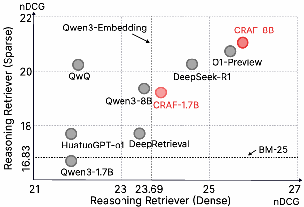

# CRAF: A Clinical Reasoning-Adaptive Framework via Reinforcement Learning for Similar Case Retrieval
Official PyTorch implementation of the paper "CRAF: A Clinical Reasoning-Adaptive Framework via Reinforcement Learning for Similar Case Retrieval" and the code will coming soon. 🎈

## Overview

With the advancement of information retrieval (IR) technologies toward deep semantic understanding, reasoning-based methods—featuring explicit chain-of-thought generation—have demonstrated significant advantages in multi-hop and causal reasoning tasks. However, in complex clinical case retrieval scenarios, implicit reasoning cues within clinical data often hinder current models from effectively capturing deep semantic associations between queries and cases. Query rewriting and expansion techniques based on reasoning offer a promising solution to this challenge by uncovering and completing the latent clinical intent behind user queries, thereby enhancing semantic coverage and reasoning sensitivity. In this paper, we propose CRAF, a clinically adaptive reasoning framework tailored for similar case retrieval. Our method generates clinical reasoning paths and incorporates a fine-grained semantic reward mechanism, enabling efficient query rewriting through reinforcement learning. Experimental results on the PMC-Patients benchmark demonstrate that CRAF consistently delivers robust improvements across multiple retrieval tasks, achieving reasoning performance comparable to that of commercial models. 

## License

### Usage Terms
- **Research Use**: Permitted for academic and non-commercial research purposes
- **Commercial Use**: Requires explicit permission from the authors
- **Attribution**: Must cite the original paper when using this work
- **Redistribution**: Limited to non-commercial educational purposes